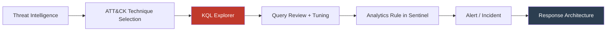

## Executive Summary

Der MITRE ATT&CK KQL Explorer schließt die Lücke zwischen Coverage-Mapping und Detection-Code. Die meisten Organisationen nutzen den ATT&CK Navigator, um Coverage zu visualisieren – aber die Verbindung zu den tatsächlichen Analytics Rules ist manuell, fragmentiert und undokumentiert. Der Explorer verknüpft jede Technik der Enterprise Matrix direkt mit kuratierten, production-ready KQL-Queries für Microsoft Sentinel und Defender XDR.

## Problem → Lösung

### Das Coverage-Paradox

| Ist-Zustand | Problem |
|-------------|---------|
| ATT&CK Navigator | Zeigt Coverage als Heatmap, aber keine Verbindung zum Code |
| Vendor-Dokumentation | Query-Beispiele verstreut über Blogposts, Docs, GitHub |
| Interne Mappings | Excel-Listen, die nach dem ersten Sprint nicht mehr gepflegt werden |
| Community-Queries | Qualität variiert, keine Severity/Confidence-Bewertung |

### Der Explorer löst

| Feature | Nutzen |
|---------|--------|
| Interaktive ATT&CK Matrix | Visueller Einstieg, keine separate Navigator-Instanz nötig |
| Kuratierte KQL-Queries pro Technik | Production-ready, nicht "Beispiel aus dem Blogpost" |
| Severity + Confidence Tagging | Priorisierung ohne manuelles Assessment |
| Copy-to-Clipboard | Kein Formatierungs-Overhead beim Transfer in Sentinel |
| Open Source | Community-getrieben, transparent, erweiterbar |

## Architektonischer Kontext

### Wo der Explorer in die Detection-Pipeline passt

Der Explorer sitzt zwischen Threat Intelligence und Analytics Rule Deployment. Er ersetzt den manuellen Schritt "Query für diese Technik finden und anpassen".

### Zusammenspiel mit der Serie

| Serien-Episode | Verbindung zum Explorer |
|----------------|----------------------|
| S1E3 – SIEM ohne Hypothesen ist blind | Explorer liefert hypothesenbasierte Queries pro Technik |
| S2E1 – Detection Engineering ist Produktentwicklung | Explorer als Baustein im Detection-Engineering-Workflow |
| S3E4 – Kill Chain endet nicht bei Detect | Explorer deckt Detection-Seite ab; Response-Mapping ist der nächste Schritt |
| S4E1-E4 – Response als Engineering | Explorer als Foundation: Ohne strukturierte Detection keine strukturierte Response |

## Community-Aspekt

### Contribution-Modell

Das Projekt lebt von der Community. Jeder kann:
- Neue KQL-Queries für Techniken beitragen
- Bestehende Queries verbessern (Tuning, FP-Reduktion)
- Severity/Confidence-Bewertungen challengen
- Fehlende Techniken melden

### Qualitätskriterien für Queries

| Kriterium | Minimum | Ideal |
|-----------|---------|-------|
| Getestet in Produktionsumgebung | Ja | Ja, mit dokumentierter FP-Rate |
| Severity-Bewertung | Vorhanden | Mit Begründung |
| Confidence-Bewertung | Vorhanden | Basierend auf Datenqualität |
| Tuning-Hinweise | Optional | Ja, mit Kontextbeispielen |
| Datenquelle dokumentiert | Ja | Ja, inkl. erforderlichem Log-Level |

## Key Takeaways

1. Coverage-Mapping ohne Code-Verbindung ist ein Dashboard, kein Werkzeug.
2. Detection-Qualität steigt, wenn Queries kuratiert und bewertet statt nur gesammelt werden.
3. Open Source in Detection Engineering ist kein Nice-to-have, sondern ein Multiplikator.
4. Der Explorer ist die Detection-Foundation – Response-Mapping (Staffel 4) baut darauf auf.

## Links

- Tool: https://mitre.triath.xyz/
