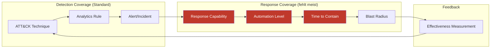

# Die Kill Chain endet nicht bei Detect


## Executive Summary

MITRE ATT&CK hat Detection revolutioniert. Fast jede Organisation mapped ihre Analytics Rules gegen ATT&CK-Techniken. Aber für Response existiert kein vergleichbares Framework. Contain, Eradicate, Recover werden ad-hoc entschieden, nicht architektonisch geplant. Das Ergebnis: Organisationen wissen genau, welche Angriffstechnik genutzt wird – aber nicht, welche Gegenmaßnahme ihr System dafür hat.

## Das asymmetrische Mapping

### Detection: Strukturiert

```
T1078 (Valid Accounts)     → Analytics Rule: Suspicious Sign-in
T1059 (Command Scripting)  → Analytics Rule: PowerShell Anomaly
T1486 (Data Encrypted)     → Analytics Rule: Ransomware Pattern
```

Jede Technik hat mindestens eine Detection Rule. Coverage wird gemessen, Gaps werden identifiziert.

### Response: Unstrukturiert

```
T1078 (Valid Accounts)     → "Analyst soll Account deaktivieren"
T1059 (Command Scripting)  → "Analyst soll Host isolieren"
T1486 (Data Encrypted)     → "Incident Commander rufen"
```

Keine definierte Capability. Keine Zeitmessung. Kein Automatisierungsgrad.

## Response-Capability-Matrix

### Vorlage: ATT&CK Technique → Response Mapping

| ATT&CK Technique | Detection | Containment Capability | Automation Level | Time to Contain | Blast Radius |
|-------------------|-----------|----------------------|-----------------|-----------------|-------------|
| T1078 Valid Accounts | SigninLogs Anomaly | Entra ID: Disable User + Revoke Sessions | Voll (Logic App) | <2 min | 1 User |
| T1059.001 PowerShell | MDE Alert | MDE: Isolate Machine | Semi (Approval) | <5 min | 1 Host |
| T1486 Ransomware | MDE + Sentinel Fusion | MDE: Isolate + Network Segmentation | Semi (Approval) | <10 min | Segment |
| T1071 Application Layer Protocol | Network Analytics | Firewall Rule / Conditional Access | Manuell | 30+ min | Variabel |
| T1098 Account Manipulation | AuditLogs | Entra ID: Revert Changes + Disable | Teilweise | <5 min | 1 User |

### KQL: Coverage-Gap-Analyse

```kql
// Welche Incident-Typen haben keine automatisierte Response?
SecurityIncident
| where TimeGenerated > ago(90d)
| where Status == "Closed"
| extend Tactics = tostring(AdditionalData.tactics)
| extend HasAutomatedResponse = isnotempty(ProviderName) and ProviderName contains "Logic"
| extend ResponseMinutes = datetime_diff('minute', 
    todatetime(FirstModifiedTime), todatetime(CreatedTime))
| summarize 
    TotalIncidents = count(),
    AutomatedCount = countif(HasAutomatedResponse),
    ManualCount = countif(not(HasAutomatedResponse)),
    AvgResponseMinutes = avg(ResponseMinutes),
    AutomationRatio = round(100.0 * countif(HasAutomatedResponse) / count(), 1)
    by Tactics
| extend ResponseGap = iff(AutomationRatio < 50, "CRITICAL", 
                      iff(AutomationRatio < 80, "MODERATE", "COVERED"))
| order by TotalIncidents desc
```

## Von Detection-Coverage zu Response-Coverage



## Response-Reifegrad pro Technik

| Level | Beschreibung | Beispiel |
|-------|-------------|---------|
| 0 – Keine Response | Wird detektiert, aber keine definierte Aktion | "Wir sehen es, tun aber nichts Definiertes" |
| 1 – Dokumentiert | Playbook beschreibt Schritte | Confluence-Seite |
| 2 – Manuell strukturiert | Definierte Aktion, manuell ausgeführt | Analyst führt Entra ID Disable aus |
| 3 – Semi-automatisiert | Automation mit Approval-Step | Logic App mit Teams-Approval |
| 4 – Voll automatisiert | End-to-End ohne menschliche Intervention | Auto-Isolate bei High-Confidence Alert |

Ziel ist nicht Level 4 für alles. Ziel ist eine bewusste Entscheidung pro Technik.

## Key Takeaways

1. Detection-Coverage ohne Response-Coverage ist eine halbe Sicherheitsarchitektur.
2. Für jede ATT&CK-Technik, die detektiert wird, sollte eine definierte Response-Capability existieren – mit Automationsgrad, Zeitrahmen und Blast Radius.
3. Response-Coverage ist messbar und mappbar, genau wie Detection-Coverage.
4. Die Entscheidung "manuell vs. automatisiert" ist kein Default, sondern eine architektonische Designentscheidung pro Technik.

## Action Items

- [ ] Response-Capability-Matrix erstellen: Top-10 detektierte ATT&CK-Techniken gegen vorhandene Response-Capabilities mappen.
- [ ] Gap-Analyse: Für welche Techniken existiert keine definierte Containment-Aktion?
- [ ] Priorisierung: Techniken nach Häufigkeit × Impact priorisieren und Response-Automation planen.
