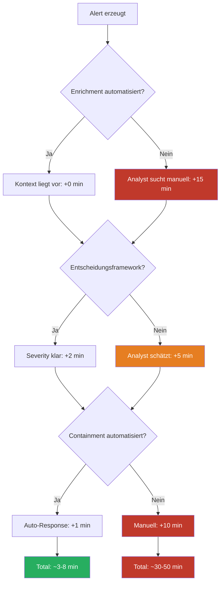

## Executive Summary

Mean Time to Respond (MTTR) wird in den meisten Organisationen als SOC-Leistungsmetrik behandelt. Das ist ein fundamentaler Denkfehler. MTTR misst nicht die Geschwindigkeit des Analysten, sondern die Qualität der Architektur dahinter. Ein hoher MTTR ist fast immer ein Symptom von fehlender Automation, fehlendem Kontext-Enrichment und fehlenden Entscheidungsvorlagen – nicht von langsamen Menschen.

## Anatomie einer Response-Zeit

### Typischer Incident-Ablauf (manuell)

| Phase | Dauer (typisch) | Wertschöpfung | Architektur-Abhängigkeit |
|-------|-----------------|---------------|--------------------------|
| Alert-Triage | 5 min | Gering – Rauschfilter | Analytics Rule Qualität |
| Kontext sammeln | 15 min | Keine – reine Datenbeschaffung | Enrichment-Automation |
| Tool-Wechsel | 5 min | Keine – Friction | Integration / Single Pane |
| Severity bewerten | 5 min | Mittel – Entscheidung | Decision Framework |
| Containment ausführen | 5 min | Hoch – eigentliche Response | API-Integration |
| Dokumentation | 10 min | Keine – Compliance | Automation / Templates |
| **Gesamt** | **45 min** | **~10 min echte Analyse** | |

Von 45 Minuten sind 35 Minuten Systemversagen, das der Analyst manuell kompensiert.

### Derselbe Incident mit Architektur

| Phase | Dauer | Wie |
|-------|-------|-----|
| Alert + Auto-Enrichment | 0 min | Automation Rule + Playbook |
| Kontext liegt vor | 0 min | KQL-Enrichment im Incident |
| Analyst bewertet | 5 min | Decision Matrix im Incident-Kommentar |
| Containment | 1 min | One-Click oder Auto |
| Dokumentation | 0 min | Structured Data, automatisch |
| **Gesamt** | **6 min** | |

Der Analyst ist nicht schneller geworden. Das System hat aufgehört, ihn auszubremsen.

## KQL: MTTR als Architektur-Diagnose

```kql
// MTTR-Analyse: Wo verliert ihr Zeit?
SecurityIncident
| where TimeGenerated > ago(30d)
| where Status == "Closed"
| extend CreatedTime = todatetime(CreatedTime),
         FirstActionTime = todatetime(FirstModifiedTime),
         ClosedTime = todatetime(ClosedTime)
| extend TimeToFirstAction = datetime_diff('minute', FirstActionTime, CreatedTime),
         TimeToClose = datetime_diff('minute', ClosedTime, CreatedTime),
         TriageTime = datetime_diff('minute', FirstActionTime, CreatedTime)
| summarize 
    AvgTimeToFirstAction = avg(TimeToFirstAction),
    P50_TimeToFirstAction = percentile(TimeToFirstAction, 50),
    P95_TimeToFirstAction = percentile(TimeToFirstAction, 95),
    AvgTimeToClose = avg(TimeToClose),
    IncidentCount = count()
    by Severity
| order by Severity asc
```

```kql
// Vergleich: Incidents mit vs. ohne Automation
SecurityIncident
| where TimeGenerated > ago(30d)
| where Status == "Closed"
| extend HasAutomation = isnotempty(ProviderName) and ProviderName contains "Logic"
| extend ResponseMinutes = datetime_diff('minute', 
    todatetime(FirstModifiedTime), todatetime(CreatedTime))
| summarize 
    AvgResponse = avg(ResponseMinutes),
    MedianResponse = percentile(ResponseMinutes, 50),
    Count = count()
    by HasAutomation
```

## Das Architektur-Delta



Das Delta zwischen 8 und 45 Minuten ist keine Personalfrage. Es ist eine Architekturentscheidung.

## MTTR richtig messen

| Metrik | Misst | Architektur-Relevanz |
|--------|-------|---------------------|
| Time to First Action | Wie schnell reagiert das System (nicht der Mensch) | Automation-Reifegrad |
| Time to Enrichment | Wie schnell liegt Kontext vor | Enrichment-Pipeline |
| Time to Containment | Wie schnell ist die Bedrohung eingedämmt | Response-Integration |
| Time to Close | Gesamtdauer inkl. Dokumentation | End-to-End Prozessreife |
| Automation Ratio | Anteil automatisierter vs. manueller Schritte | Architektur-Investition |

Die wichtigste Metrik: **Time to First Automated Action**. Das ist der Punkt, an dem Architektur aufhört und menschliche Kompensation beginnt.

## Key Takeaways

1. MTTR ist eine Architektur-Metrik, keine Personal-Metrik. Wer Analysten für hohe MTTR verantwortlich macht, löst das falsche Problem.
2. Die meiste Response-Zeit ist Datenbeschaffung und Tool-Wechsel – beides Architekturprobleme.
3. Time to First Automated Action ist die ehrlichste Metrik für den Reifegrad einer Security-Operations-Architektur.
4. MTTR sinkt nicht durch Schulung, sondern durch Enrichment, Entscheidungsframeworks und API-Integration.

## Action Items

- [ ] MTTR-Baseline erstellen: Durchschnittliche Time to First Action der letzten 30 Tage nach Severity.
- [ ] Zeitfresser identifizieren: Die 5 Incidents mit der längsten Response-Zeit analysieren – wo ging die Zeit verloren?
- [ ] Quick Win: Für den häufigsten Incident-Typ automatisches Enrichment implementieren und MTTR vorher/nachher vergleichen.
