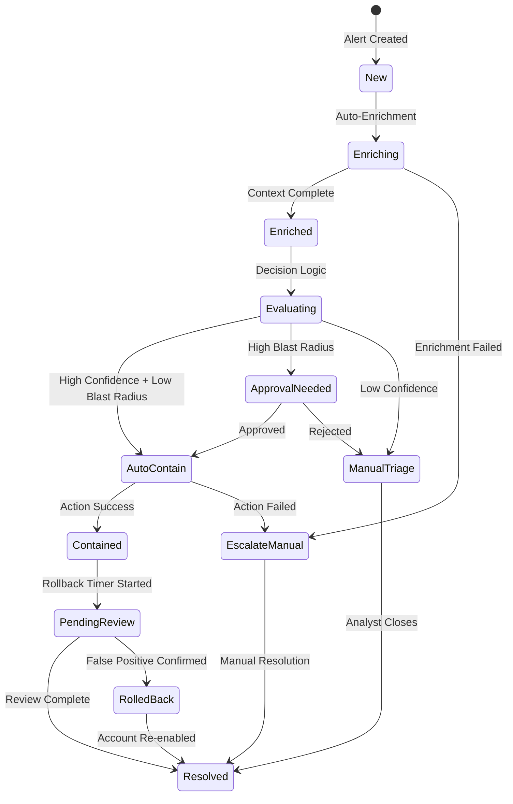

## Executive Summary

Die meisten SOAR-Implementierungen sind lineare Ketten: Trigger → API-Call → Ende. Es fehlen die drei Elemente, die Automation von Scripting unterscheiden: State Management (in welchem Zustand befindet sich der Incident?), Entscheidungslogik (welche Aktion bei welchem Kontext?) und Rollback (wie macht man eine automatisierte Aktion rückgängig?). Ohne diese drei Elemente ist SOAR kein Architekturgewinn, sondern ein automatisiertes Risiko.

## Das SOAR-Antimuster

### Typische "Automation"

```
Alert → Logic App → Disable User → Ende
```

Probleme:
- Kein State: Was passiert, wenn der Disable fehlschlägt?
- Keine Logik: Wird ein CEO genauso behandelt wie ein Testaccount?
- Kein Rollback: Wer aktiviert den Account wieder? Wann? Unter welchen Bedingungen?

### Architektonische Automation

```
Alert → Enrichment → State: Enriched
     → Decision Tree → State: Decision Made
     → Containment (mit Blast-Radius-Check) → State: Contained
     → Rollback Timer / Approval → State: Pending Review
     → Close oder Escalate → State: Resolved
```

## State Machine für Incident Response



## Entscheidungslogik: Context-Aware Response

### Logic App mit Blast-Radius-Check

```json
{
  "Evaluate_Response_Action": {
    "type": "Switch",
    "expression": "@variables('ResponseDecision')",
    "cases": {
      "Auto_Contain": {
        "condition": "@and(greater(variables('DetectionConfidence'), 0.95), equals(body('Check_User_Role')?['IsPrivileged'], false), less(body('Count_Affected_Services')?['count'], 3))",
        "actions": {
          "Disable_User": {},
          "Revoke_Sessions": {},
          "Set_Rollback_Timer": {
            "type": "Wait",
            "inputs": { "interval": { "count": 4, "unit": "Hour" } }
          },
          "Create_Rollback_Task": {
            "type": "ApiConnection",
            "inputs": {
              "body": {
                "title": "Review auto-containment: @{variables('UserPrincipalName')}",
                "description": "Auto-disabled at @{utcNow()}. Rollback deadline: 4h.",
                "assignedTo": "@{variables('IncidentOwner')}"
              }
            }
          }
        }
      },
      "Approval_Required": {
        "condition": "@or(equals(body('Check_User_Role')?['IsPrivileged'], true), greaterOrEquals(body('Count_Affected_Services')?['count'], 3))",
        "actions": {
          "Send_Teams_Approval": {
            "type": "ApiConnection",
            "inputs": {
              "body": {
                "title": "Containment Approval Required",
                "message": "User: @{variables('UserPrincipalName')}\nRole: @{body('Check_User_Role')?['JobTitle']}\nRisk: @{variables('RiskScore')}\nProposed Action: Disable Account + Revoke Sessions",
                "options": "Approve,Reject,Escalate"
              }
            }
          }
        }
      }
    }
  }
}
```

## Rollback-Design

### Prinzipien

| Prinzip | Beschreibung | Beispiel |
|---------|-------------|---------|
| Jede Aktion braucht eine Gegenaktion | Kein Disable ohne Re-Enable-Pfad | Rollback-Task mit Deadline |
| State vor der Aktion speichern | Originalzustand dokumentieren | User-Properties vor Disable sichern |
| Zeitfenster definieren | Rollback-Deadline pro Aktionstyp | 4h für Account Disable, 24h für Device Wipe |
| Rollback ≠ Undo | Rollback prüft, ob der Kontext sich geändert hat | Neuer Alert während Rollback → Abbruch |

### KQL: Rollback-Monitoring

```kql
// Automatisierte Aktionen ohne Rollback-Completion
let AutoActions = AuditLogs
| where TimeGenerated > ago(7d)
| where InitiatedBy has "Logic App" or InitiatedBy has "Automation"
| where OperationName in ("Disable account", "Revoke sign in sessions", "Block user")
| extend ActionTarget = tostring(TargetResources[0].userPrincipalName),
         ActionTime = TimeGenerated,
         ActionType = OperationName;
//
let Rollbacks = AuditLogs
| where TimeGenerated > ago(7d)
| where OperationName in ("Enable account", "Reset user password")
| extend RollbackTarget = tostring(TargetResources[0].userPrincipalName),
         RollbackTime = TimeGenerated;
//
AutoActions
| join kind=leftanti Rollbacks on $left.ActionTarget == $right.RollbackTarget
| extend HoursSinceAction = datetime_diff('hour', now(), ActionTime)
| where HoursSinceAction > 4
| project ActionTarget, ActionType, ActionTime, HoursSinceAction
| order by HoursSinceAction desc
```

## Key Takeaways

1. SOAR ohne State Management ist ein Script, keine Automation.
2. Entscheidungslogik muss Kontext berücksichtigen: Rolle, Blast Radius, Confidence.
3. Jede automatisierte Aktion braucht einen definierten Rollback-Pfad mit Zeitfenster.
4. Der Reifegrad einer Automation zeigt sich nicht an der Anzahl der Playbooks, sondern an der Fehlerbehandlung.

## Action Items

- [ ] Audit: Bestehende Logic Apps / SOAR-Playbooks auf State Management prüfen – wie viele haben Fehlerbehandlung?
- [ ] Rollback-Inventur: Für welche automatisierten Aktionen existiert ein definierter Rollback-Pfad?
- [ ] Design: Für die häufigste automatisierte Aktion eine State Machine entwerfen mit Enrichment → Decision → Action → Rollback.
