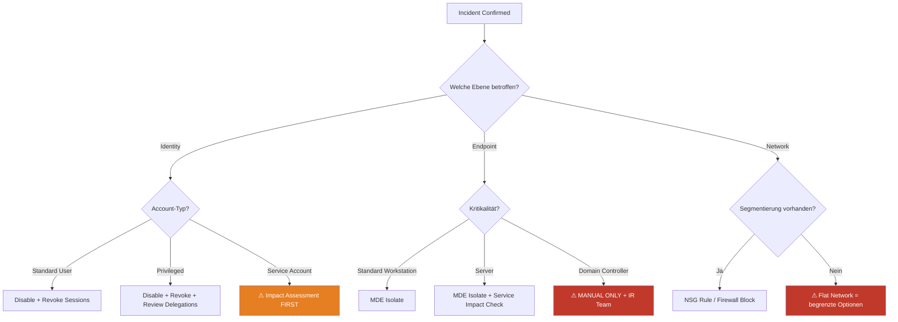

## Executive Summary

Containment-Fähigkeiten werden nicht im Incident geschaffen, sondern in der Architektur davor. Die meisten Organisationen planen Detection monatelang, testen aber ihre Containment-Capabilities erst beim ersten echten Incident. Das Ergebnis: Im Ernstfall stellt sich heraus, dass Netzwerksegmentierung nicht granular genug ist, Service Accounts alles mitreißen und Isolation-Aktionen ungetestete Seiteneffekte haben.

## Containment-Ebenen im Microsoft-Stack

### Architektur-Übersicht

| Ebene | Tool / Capability | Aktion | Automatisierbar | Seiteneffekte |
|-------|-------------------|--------|----------------|---------------|
| Identity | Entra ID | Disable User, Revoke Sessions, Force MFA | Ja (Graph API) | Shared Accounts, Service Principals |
| Endpoint | MDE | Isolate Machine, Restrict App Execution | Ja (MDE API) | VPN-Disconnect, Monitoring-Gap |
| Netzwerk | NSG / Azure Firewall | Block IP, Isolate Subnet | Ja (ARM API) | Lateral Services, Shared Subnets |
| Applikation | Conditional Access | Block App Access, Require Compliant Device | Ja (Graph API) | Berechtigungs-Cascades |
| Daten | Purview / DLP | Block Sharing, Revoke Access | Teilweise | Kollaborations-Impact |

### KQL: Containment-Readiness Check

```kql
// Welche Isolations-Aktionen wurden in den letzten 90 Tagen ausgeführt?
// Zeigt: Was könnt ihr wirklich, nicht was ihr glaubt zu können
let IdentityActions = AuditLogs
| where TimeGenerated > ago(90d)
| where OperationName in ("Disable account", "Revoke sign in sessions", 
    "Update conditional access policy", "Block user sign-in")
| extend Layer = "Identity", Action = OperationName;
//
let EndpointActions = DeviceEvents
| where TimeGenerated > ago(90d)
| where ActionType in ("IsolateDevice", "RestrictExecution", "RunAntiVirusScan")
| extend Layer = "Endpoint", Action = ActionType;
//
union IdentityActions, EndpointActions
| summarize 
    ActionCount = count(),
    LastUsed = max(TimeGenerated),
    DaysSinceLastUse = datetime_diff('day', now(), max(TimeGenerated))
    by Layer, Action
| order by Layer, ActionCount desc
```

## Dependency-Mapping: Was bricht?

### Vor dem Incident verstehen

```kql
// Service Principal Dependencies: Was hängt an einem User?
let TargetUser = "user@company.com";
//
let OwnedApps = AuditLogs
| where TimeGenerated > ago(90d)
| where InitiatedBy has TargetUser
| where OperationName has "application" or OperationName has "service principal"
| distinct TargetResources;
//
let AutomationDependencies = AuditLogs
| where TimeGenerated > ago(30d)
| where InitiatedBy has "ServicePrincipal"
| summarize ActionCount = count(), 
            Actions = make_set(OperationName),
            LastActivity = max(TimeGenerated)
    by ServicePrincipalName = tostring(InitiatedBy_app.displayName)
| where ActionCount > 10;
//
AutomationDependencies
| order by ActionCount desc
```

## Containment-Entscheidungsmatrix



## Pre-Incident Containment Testing

| Test | Methode | Frequenz | Ownership |
|------|---------|----------|-----------|
| Account Disable + Re-Enable | Test-Account in Produktion | Monatlich | IAM + SecOps |
| MDE Host Isolation | Dedizierter Testhost | Quartalsweise | Endpoint + SecOps |
| Network Segmentation | Firewall Rule Test + Connectivity Check | Quartalsweise | Network + SecOps |
| Conditional Access Override | Test-Policy mit begrenztem Scope | Monatlich | IAM + SecOps |
| Rollback aller Aktionen | Vollständiger Reverse-Test | Quartalsweise | SecOps |

## Key Takeaways

1. Containment-Capabilities werden in der Architektur geschaffen, nicht im Incident.
2. Die kritischste Frage ist nicht "Was können wir isolieren?" sondern "Was bricht, wenn wir es tun?"
3. Service Accounts und Shared Resources sind die häufigsten Containment-Blocker.
4. Ungetestete Containment-Aktionen sind keine Capabilities, sondern Hypothesen.

## Action Items

- [ ] Containment-Inventur: Welche Isolations-Aktionen kann euer Stack technisch ausführen?
- [ ] Dependency-Mapping: Für die Top-5 kritischen Accounts/Hosts dokumentieren, was bei Isolation bricht.
- [ ] Testplan: Quartalsweise Containment-Tests für jede Ebene (Identity, Endpoint, Network) einführen.
