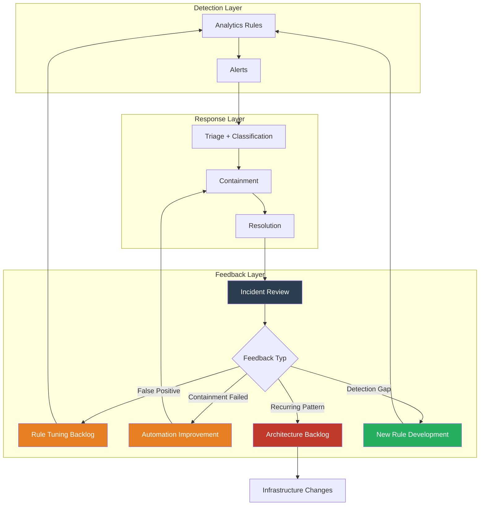

## Executive Summary

Die meisten SOCs operieren als Open-Loop-Systeme: Alert → Triage → Response → Close. Es fehlt der geschlossene Kreislauf, in dem Response-Daten zurück in Detection-Engineering fließen. Ohne diesen Feedback-Loop wiederholen sich dieselben Alerts, dieselben False Positives und dieselben manuellen Entscheidungen. Der Unterschied zwischen einem SOC, das arbeitet, und einem SOC, das lernt, ist architektonisch – nicht kulturell.

## Open Loop vs. Closed Loop

### Open Loop (Standard)

```
Detection → Alert → Triage → Response → Close → [Ende]
                                                    ↓
                                            Nächster Alert (identisch)
```

### Closed Loop (Ziel)

```
Detection → Alert → Triage → Response → Close
    ↑                                      ↓
    ← ← ← ← Feedback ← ← ← ← ← ← ← ← ←
    
Feedback enthält:
- False Positive Rate pro Rule
- Containment Effectiveness
- Recurring Patterns
- Detection Gap Signals
```

## Drei Feedback-Kanäle

### 1. Response → Detection: War der Alert korrekt?

```kql
// False Positive Rate pro Analytics Rule (letzten 30 Tage)
SecurityIncident
| where TimeGenerated > ago(30d)
| where Status == "Closed"
| extend Classification = tostring(Classification)
| extend RuleName = tostring(AlertProductNames)
| summarize 
    Total = count(),
    TruePositive = countif(Classification == "TruePositive"),
    FalsePositive = countif(Classification == "FalsePositive"),
    BenignPositive = countif(Classification == "BenignPositive"),
    Undetermined = countif(Classification == "Undetermined")
    by RuleName
| extend FP_Rate = round(100.0 * FalsePositive / Total, 1),
         Actionable_Rate = round(100.0 * TruePositive / Total, 1)
| where Total > 5
| order by FP_Rate desc
```

Jede Rule mit >30% FP-Rate ist ein Kandidat für Redesign. Aber nur, wenn dieses Feedback systematisch erhoben wird.

### 2. Response → Automation: War die Aktion wirksam?

```kql
// Containment Effectiveness: Hat die Aktion den Angriff gestoppt?
let ContainmentActions = AuditLogs
| where TimeGenerated > ago(30d)
| where OperationName in ("Disable account", "Revoke sign in sessions")
| extend ContainedUser = tostring(TargetResources[0].userPrincipalName),
         ContainmentTime = TimeGenerated;
//
// Post-Containment Activity: Gab es weitere verdächtige Aktivität?
let PostContainmentActivity = SigninLogs
| where TimeGenerated > ago(30d)
| where ResultType != 0; // Failed sign-ins
//
ContainmentActions
| join kind=leftouter (
    PostContainmentActivity
    | summarize PostContainmentAttempts = count(),
                LastAttempt = max(TimeGenerated)
      by UserPrincipalName
) on $left.ContainedUser == $right.UserPrincipalName
| extend ContainmentEffective = iff(isnull(PostContainmentAttempts) or PostContainmentAttempts == 0, 
    "Effective", "Continued Activity Detected")
| summarize 
    TotalContainments = count(),
    EffectiveCount = countif(ContainmentEffective == "Effective"),
    EffectivenessRate = round(100.0 * countif(ContainmentEffective == "Effective") / count(), 1)
```

### 3. Incidents → Architecture: Welche Gaps wiederholen sich?

```kql
// Recurring Incident Patterns: Gleicher Typ, gleiche Root Cause
SecurityIncident
| where TimeGenerated > ago(90d)
| where Status == "Closed"
| extend RootCause = tostring(AdditionalData.rootCause),
         IncidentType = tostring(Title)
| summarize 
    Occurrences = count(),
    FirstSeen = min(TimeGenerated),
    LastSeen = max(TimeGenerated),
    AvgResponseMinutes = avg(
        datetime_diff('minute', todatetime(ClosedTime), todatetime(CreatedTime))
    )
    by IncidentType
| where Occurrences > 3
| extend RecurrenceStatus = case(
    Occurrences > 10, "SYSTEMIC – Architecture Change Required",
    Occurrences > 5, "RECURRING – Process Improvement Needed",
    "OCCASIONAL – Monitor"
)
| order by Occurrences desc
```

## Feedback-Loop-Architektur



## Feedback-Prozess: Minimum Viable Loop

| Schritt | Frequenz | Owner | Output |
|---------|----------|-------|--------|
| Incident Classification Review | Wöchentlich | SOC Lead | FP-Rate pro Rule |
| Containment Effectiveness Check | Wöchentlich | Detection Engineer | Automation-Improvement Backlog |
| Recurring Pattern Analysis | Monatlich | Security Architect | Architecture Decision Records |
| Detection Gap Review | Monatlich | Detection Engineer | New Rule Backlog |
| Quarterly Detection Health Report | Quartalsweise | Security Architect | Strategic Recommendations |

## Key Takeaways

1. Ein SOC ohne Feedback-Loop ist ein Fließband, kein lernendes System.
2. Drei Feedback-Kanäle: Response → Detection (FP-Rate), Response → Automation (Effectiveness), Incidents → Architecture (Recurring Patterns).
3. Feedback ist nicht kulturell, sondern architektonisch: Es braucht definierte Datenflüsse, nicht nur guten Willen.
4. Der Minimum Viable Loop: Wöchentliche FP-Rate-Review + monatliche Recurring-Pattern-Analyse.

## Action Items

- [ ] FP-Rate Dashboard: KQL-Query für False-Positive-Rate pro Analytics Rule implementieren.
- [ ] Wöchentlicher Review: 30-Minuten-Termin für Incident-Classification-Review einführen.
- [ ] Feedback-Backlog: Jira/ADO Board für Detection-Improvements anlegen, gefüttert aus Incident-Reviews.
