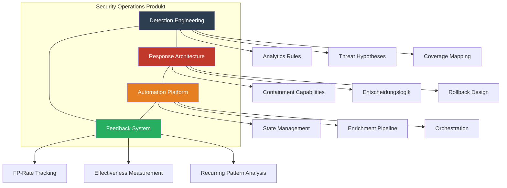

## Executive Summary

Security Operations wird in den meisten Organisationen als Funktion behandelt – ein Team, das Alerts bearbeitet. Die reiferen Organisationen behandeln es als Produkt: mit definierten Nutzern, einer Roadmap, Metriken und iterativer Verbesserung. Diese Episode schließt den Bogen der gesamten Serie und zeigt, wie Detection, Response, Automation und Feedback als integriertes System zusammenwirken.

## Der Bogen der Serie

### Staffel 1-2 (abgeschlossen): Was ist ein SIEM?

```
Daten → Denken → Architektur → Ownership → Entscheidungs-System
```

### Staffel 3: Die Lücke nach dem Alert

```
Detection ≠ Response → Playbook ≠ Prozess → MTTR = Architektur → Kill Chain = End-to-End
```

### Staffel 4: Response als Engineering

```
Automation ≠ Scripting → Containment = Design → Feedback = Lernen → SecOps = Produkt
```

## Security Operations als Produkt-Framework

### Product Canvas für SecOps

| Dimension | Typisch (Funktion) | Ziel (Produkt) |
|-----------|-------------------|----------------|
| Nutzer | "Das SOC-Team" | Analysten (Tier 1-3), Incident Commander, CISO, Business Stakeholder |
| Problem | "Alerts bearbeiten" | Unter Unsicherheit schnelle, richtige Entscheidungen treffen |
| Wertversprechen | "Wir überwachen die Umgebung" | Wir reduzieren Mean Time to Decision bei Security-Events |
| Roadmap | "Nächstes Tool kaufen" | Welche Entscheidung wollen wir in 6 Monaten schneller treffen? |
| Metriken | Dashboard mit Alert-Volumen | Feedback-Loops: FP-Rate, MTTR, Containment Effectiveness |
| Iteration | Jährliches SIEM-Review | Wöchentliche Detection-Health-Review, monatliche Architektur-Iteration |

### Die vier Säulen



## Reifegradmodell: Von Funktion zu Produkt

| Level | Beschreibung | Detection | Response | Automation | Feedback |
|-------|-------------|-----------|----------|------------|----------|
| 0 – Reaktiv | Alert-Fließband | Vendor-Default-Rules | Ad-hoc, manuell | Keine | Keine |
| 1 – Dokumentiert | Playbooks existieren | Eigene Rules, kein Mapping | Playbooks in Wiki | Einzelne Scripts | Informell |
| 2 – Strukturiert | Prozesse definiert | ATT&CK-Mapping, FP-Tracking | Response-Matrix | Logic Apps (linear) | Wöchentliche Reviews |
| 3 – Integriert | End-to-End System | Hypothesenbasiert | Capability-Mapping | State Machines | Geschlossene Loops |
| 4 – Produkt | Iterative Optimierung | Kontinuierliche Verbesserung | Pre-tested Capabilities | Context-Aware | Datengetrieben |

### KQL: SecOps Product Health Dashboard

```kql
// Gesamtbild: Security Operations Produkt-Metriken
let DetectionHealth = SecurityAlert
| where TimeGenerated > ago(30d)
| summarize TotalAlerts = count(),
            UniqueRules = dcount(AlertName)
| extend Metric = "Detection", Value = TotalAlerts;
//
let ResponseHealth = SecurityIncident
| where TimeGenerated > ago(30d)
| where Status == "Closed"
| summarize 
    MTTR_Avg = avg(datetime_diff('minute', todatetime(ClosedTime), todatetime(CreatedTime))),
    MTTR_P50 = percentile(datetime_diff('minute', todatetime(ClosedTime), todatetime(CreatedTime)), 50),
    TotalIncidents = count();
//
let FeedbackHealth = SecurityIncident
| where TimeGenerated > ago(30d)
| where Status == "Closed"
| summarize 
    ClassifiedCount = countif(isnotempty(Classification)),
    TotalClosed = count()
| extend ClassificationRate = round(100.0 * ClassifiedCount / TotalClosed, 1);
//
let AutomationHealth = SecurityIncident
| where TimeGenerated > ago(30d)
| summarize 
    AutomatedActions = countif(isnotempty(ProviderName) and ProviderName contains "Logic"),
    TotalIncidents = count()
| extend AutomationRate = round(100.0 * AutomatedActions / TotalIncidents, 1);
//
// Combine for Product Health Score
ResponseHealth
| extend Detection_Rules = toscalar(DetectionHealth | project UniqueRules),
         Classification_Rate = toscalar(FeedbackHealth | project ClassificationRate),
         Automation_Rate = toscalar(AutomationHealth | project AutomationRate)
| project 
    MTTR_Minutes = MTTR_P50,
    Total_Incidents = TotalIncidents,
    Active_Detection_Rules = Detection_Rules,
    Incident_Classification_Rate = Classification_Rate,
    Response_Automation_Rate = Automation_Rate
```

## Decision Matrix: Priorisierung der nächsten Schritte

| Investment | Impact auf MTTD | Impact auf MTTR | Aufwand | Empfehlung |
|-----------|----------------|-----------------|---------|------------|
| Detection-Rule-Tuning (FP-Reduktion) | Hoch | Mittel | Gering | Sofort starten |
| Auto-Enrichment Pipeline | Gering | Hoch | Mittel | Quick Win |
| Containment-Automation (Top-5 Incident-Typen) | Gering | Sehr hoch | Mittel | Priorisieren |
| Feedback-Loop Implementation | Mittel | Mittel | Gering | Parallel |
| Response-Capability-Matrix | Gering | Hoch | Gering | Sofort starten |
| Full SOAR State Machine | Gering | Sehr hoch | Hoch | Langfristig planen |

## Key Takeaways

1. Security Operations ist kein Team-Label, sondern ein Produkt mit Nutzern, Roadmap und Metriken.
2. Die vier Säulen – Detection, Response, Automation, Feedback – müssen als integriertes System funktionieren, nicht als getrennte Workstreams.
3. Der Reifegrad zeigt sich nicht an der Tool-Anzahl, sondern an der Fähigkeit, unter Unsicherheit schnelle Entscheidungen zu treffen.
4. Die wichtigste Frage ist nicht "Welches Tool brauchen wir?" sondern "Welche Entscheidung wollen wir in 6 Monaten schneller treffen können?"

## Action Items

- [ ] Product Canvas: Security Operations als Produkt definieren – Nutzer, Problem, Wertversprechen, Metriken.
- [ ] Reifegradbestimmung: Ehrliche Einschätzung pro Säule (Detection, Response, Automation, Feedback).
- [ ] 90-Tage-Roadmap: Top-3 Investments priorisiert nach Impact/Aufwand aus der Decision Matrix.
- [ ] Stakeholder-Kommunikation: Security Operations als Produkt gegenüber Management positionieren.
